<div align="center" style="max-width: 10rem; margin: 0 auto">
  
</div>
<div align="center">
  <h1>Strapi Shopify Plugin</h1>
  <p>Out-of-the-box seamless Shopify integration for your Strapi instance</p>
  <a href="https://www.npmjs.org/package/@strapi-community/shopify">
    
  </a>
  <a href="https://www.npmjs.org/package/@strapi-community/shopify">
    
  </a>
  <a href="https://codecov.io/gh/strapi-community/shopify">
    
  </a>
</div>

A powerful Strapi plugin that seamlessly connects your Strapi application with Shopify stores through a user-friendly interface. It features a custom Shopify Product field, robust webhook management, and efficient product synchronization capabilities. The plugin comes with built-in content types for store management, along with configurable caching mechanisms to optimize performance.

## 📋 Table of Contents

- [✨ Features](#features)
- [📋 Requirements](#requirements)
- [📦 Installation](#installation)
- [⚙️ Configuration](#configuring-shopify-for-strapi-plugin-shopify-step-by-step-with-images)
- [🔧 Plugin Configuration](#configuration-config)
- [📝 Config](#config)
- [🔄 Webhook Endpoint](#webhook-endpoint)
- [🔒 Middleware Configuration](#middleware-configuration-for-raw-request-body)
- [👨‍💻 Development & Testing](#development--testing)
- [📄 License](#license)

## ✨ Features
- Manage multiple Shopify shops within Strapi
- Handle Shopify webhooks for products
- Custom field for Shopify products
- Flexible cache engine: in-memory (LRU) or Redis
- **Automatically attaches Shopify product data to Strapi content type responses** (when a content type uses the custom Shopify product field)

## 📋 Requirements
- Strapi v5.7.0 or later
- Node.js 18+
- For Redis cache: a running Redis instance

## 📦 Installation

```bash
npm install @strapi-community/strapi-plugin-shopify@latest
# or
yarn add @strapi-community/strapi-plugin-shopify@latest
```

## ⚙️ Configuring Shopify for strapi-plugin-shopify (Step-by-Step with Images)

Follow these steps to configure your Shopify store and connect it to your Strapi instance using this plugin. Visual guidance is provided with embedded images for each step.

### 1. Open Your Shopify Store
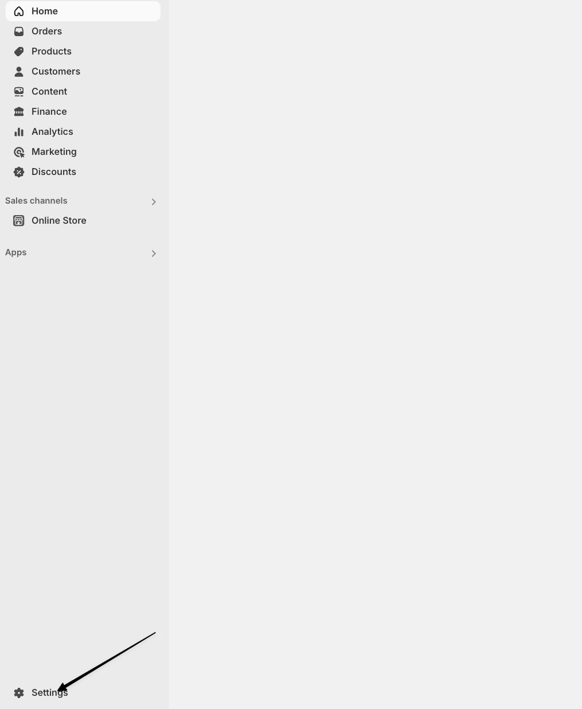
- Log in to your Shopify admin dashboard.

### 2. Go to Store Settings
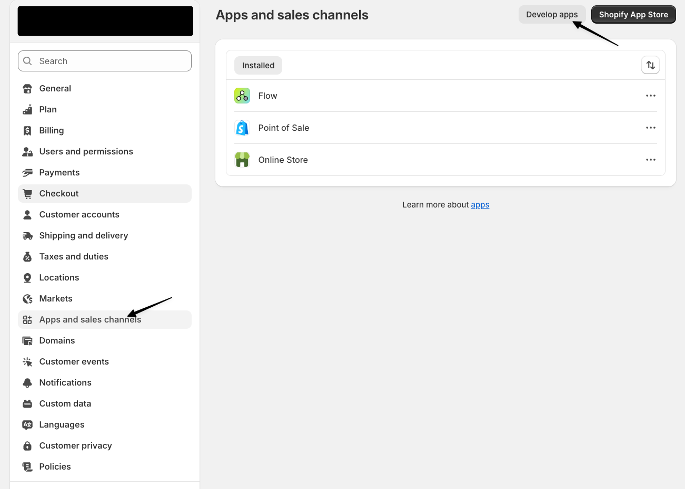
- In the Shopify admin sidebar, click on **Settings** to access your store settings.

### 3. Create a Custom App
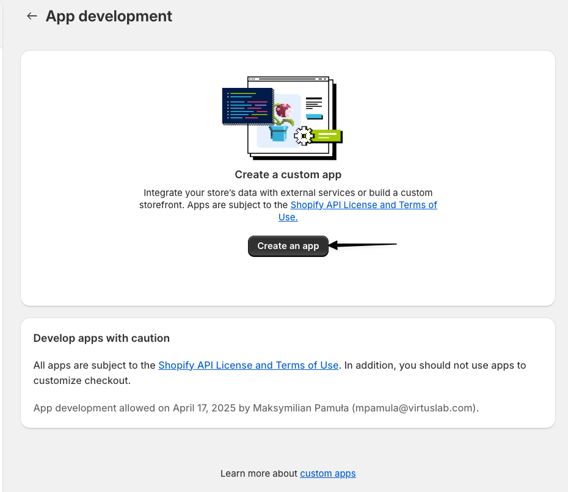
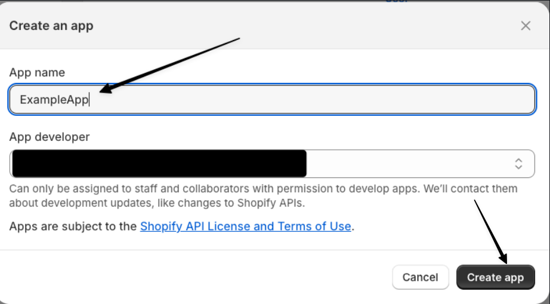
- Navigate to **Apps** in the sidebar.
- Click **Develop apps for your store** (you may need to enable this if not already done).
- Click **Create an app** and provide a name for your custom app.

### 4. Configure the Custom App
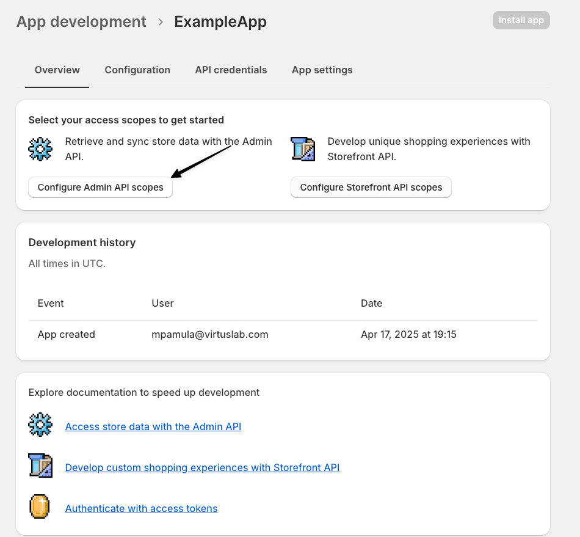
- In your new app, go to the **Configuration** tab.
- Set up the required Admin API scopes for your integration (see next step).

### 5. Set API Scopes
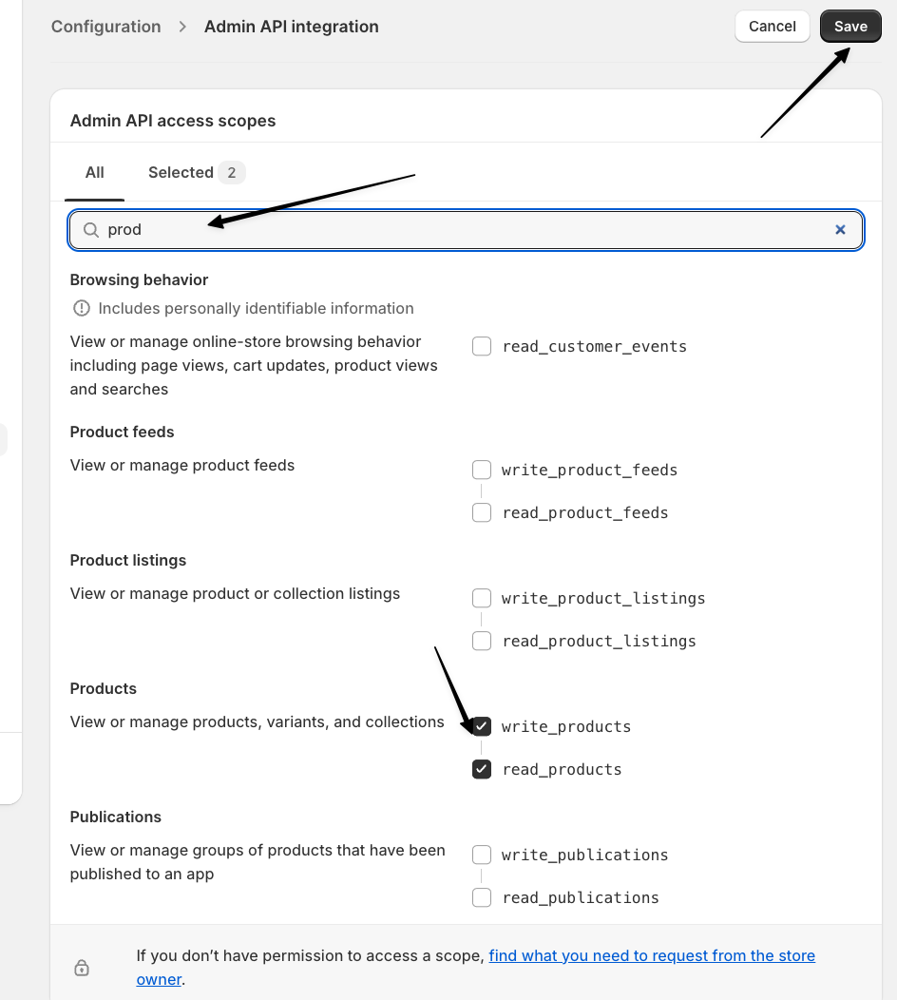
- Grant the necessary permissions (scopes) for products.

### 6. Set API Version
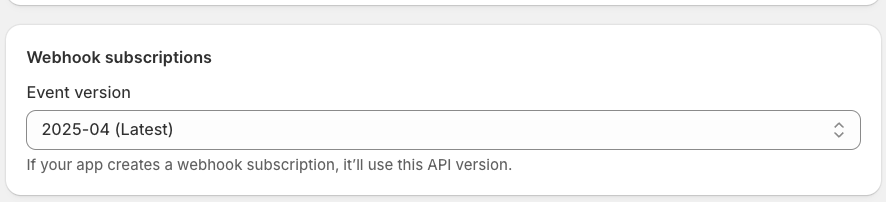
- Select the appropriate Shopify API version for your app.

### 7. Get API Credentials
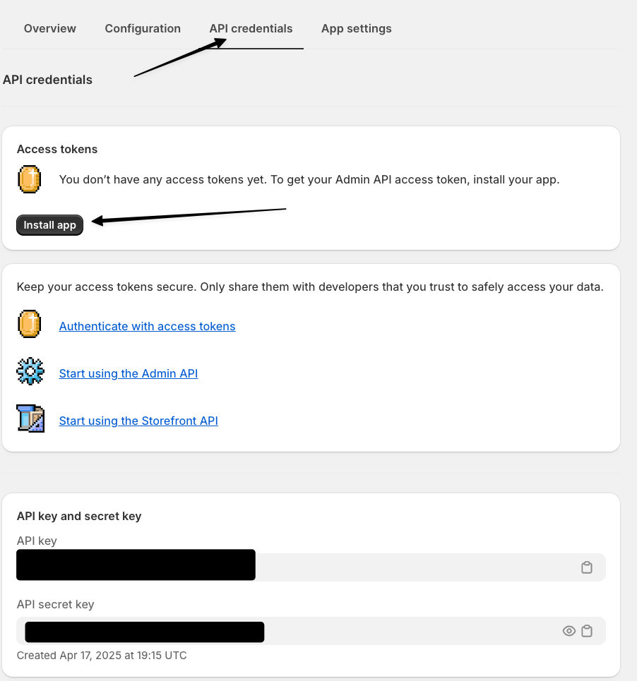
- Go to the **API credentials** tab.
- Copy the **Admin API access token** and **API key**. You will need these for the Strapi plugin configuration.

### 8. Install the Custom App
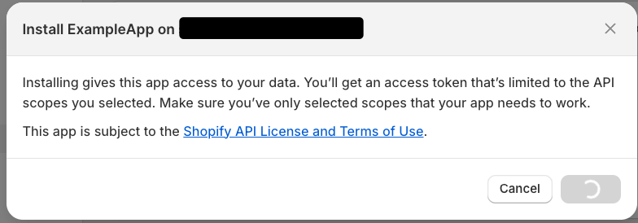
- Click **Install app** to add the custom app to your Shopify store.

### 9. Retrieve Admin Access Token
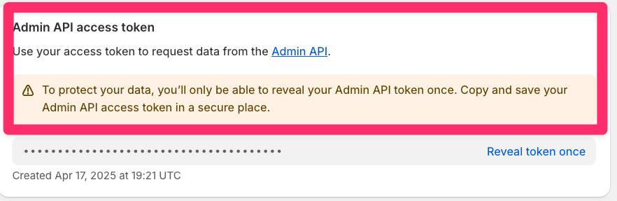
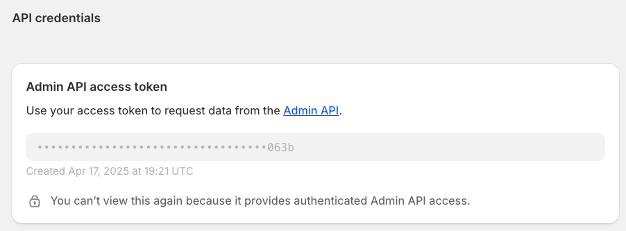
- After installation, you can view and copy your Admin API access token.

### 10. Configure the Plugin in Strapi
- Use the credentials and settings from the previous steps to fill out the Shopify Shop configuration in Strapi (see the earlier 'Configuration' section in this README).
- Example fields:
  - `address`: Your Shopify store address (e.g., `your-store.myshopify.com`)
  - `apiSecretKey`: The API secret key from your Shopify app
  - `adminApiAccessToken`: The Admin API access token
  - `apiKey`: The API key

---

**Note:**
- Make sure to set up webhooks in Shopify to point to your Strapi instance's webhook endpoint (`/api/shopify/webhooks`).
- Refer to the images for each step to ensure correct configuration.

## 🔧 Configuration (@config)

The plugin requires a configuration object. You must provide a `host` (publicly accessible URL of your Strapi instance) and select a cache engine (`memory` or `redis`).

### Schema

```
{
  host: string (URL), // required
  engine: 'memory' | 'redis', // required
  encryptionKey: string (32 chars), // required
  // If engine is 'redis', provide connection details:
  connection?: {
    host: string, // required for redis
    port: number, // required for redis
    db: number,   // required for redis
    password?: string,
    username?: string
  }
}
```

### Example (Memory Engine)
```js
module.exports = {
  host: 'https://your-strapi-instance.com',
  encryptionKey: 'random 32 chars string',
  engine: 'memory',
};
```

### Example (Redis Engine)
```js
module.exports = {
  host: 'https://your-strapi-instance.com',
  encryptionKey: 'random 32 chars string',
  engine: 'redis',
  connection: {
    host: 'localhost',
    port: 6379,
    db: 0,
    password: 'yourpassword', // optional
    username: 'youruser',     // optional
  },
};
```

## 📝 Config

### Shopify Shop
- `vendor` (string, required)
- `address` (string, required)
- `apiSecretKey` (string, required)
  _Used to validate incoming Shopify webhook signatures. Only requests signed with this key are accepted._
- `isActive` (boolean, required, default: true)
- `adminApiAccessToken` (string, required)
- `apiKey` (string)
- `webhooks` (relation to webhooks)

### Shopify Webhook
- `topic` (enum: ProductsCreate, ProductsUpdate, ProductsDelete, OrdersCreate, OrdersUpdated, OrdersDelete)
- `shopifyId` (string)
- `format` (enum: Json)
- `callbackUrl` (string)
- `errors` (json)
- `shop` (relation to shop)
- `service` (string, required)
- `method` (string, required)

### Shopify Product Attachment

When a Strapi content type includes the custom Shopify product field, the plugin will automatically attach the corresponding Shopify product data to API responses for that content type. This is handled transparently in the plugin's middleware during the `findOne` and `findMany` actions.

- **Supported queries:**
  - `findOne` (single record fetch)
  - `findMany` (list fetch, including collection endpoints)
  - Both REST and GraphQL APIs are supported if routed through Strapi's standard controllers.

- **Caching:**
  - Product data retrieval supports caching to improve performance and reduce Shopify API calls.
  - The cache engine is configurable via the plugin config (`engine: 'memory' | 'redis'`).
  - See the [Configuration](#configuration-config) section for details on setting up memory or Redis caching.
  - Cached product data is used when available; otherwise, fresh data is fetched from Shopify and stored in the cache.

**Reference:** See [`server/src/register.ts`](server/src/register.ts), middleware in the `strapi.documents.use` block for details on how product data is attached to responses.

## 🔄 Webhook Endpoint

The plugin exposes a webhook endpoint for Shopify:

```
POST /api/shopify/webhooks
```
- No authentication required
- Handles product events from Shopify
- **Security:** Every incoming webhook request is validated using the shop's `apiSecretKey` (HMAC signature) via Shopify's official SDK. Only requests with a valid signature are processed; all others are rejected.

## 🔒 Middleware Configuration for Raw Request Body

For the plugin to work correctly—especially in verifying incoming Shopify webhook signatures—it is required to have access to the raw (unparsed) request body. This is achieved by configuring Strapi's body parser middleware to include the unparsed body.

To do so, update your application's middleware configuration in `apps/example-app/config/middlewares.ts` as follows:

```js
{
  name: 'strapi::body',
  config: {
    includeUnparsed: true,
  },
}
```

This setting leverages the Koa Body parser's `includeUnparsed` option. For more details, please refer to the [Strapi V5 documentation](https://docs.strapi.io) and the koa-body parser documentation.

## 👨‍💻 Development & Testing

- Build: `yarn build`
- Test backend: `yarn test:server`
- Test frontend: `yarn test:ts:front`

## 📄 License

MIT
